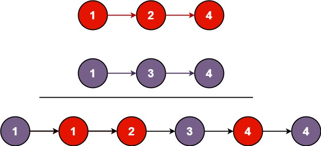

## 算法题

* [合并两个有序链表](#ListNodeMerge)
* [无重复字符的最长子串](#lengthOfLongestSubstring)
* [反转链表](#reverseLinkedList)

### <a id="ListNodeMerge">合并两个有序链表</a>

#### 题目描述：

> 1. 合并两个有序链表
> 2. 合并K个有序链表
> 3. 合并两个有序数组
> 4. 合并两个有序数组(不使用额外的空间)



```java
package com.cyberpunk.mergeTwoLIstNode;

/**
 * @author lujun
 * @date 2023/7/31 10:37
 * @description 合并两个有序链表
 */
@SuppressWarnings("all")
public class Solution {


  /**
   * 合并两个单向列表 采用循环比较的方式
   *
   * @param list1 e.g [1,2,4]
   * @param list2 e.g [1,3,4]
   * @return e.g [1,1,2,3,4,4]
   * @description: 实现方案： 定义一个虚拟节点头dummy  然后比较p1 p2 的值
   * p1.val < p2.val 这时候dummy.next =p1 然后p1 =p1.next
   * p1.val>=p2.val 这时候dummy.next =p2 然后p2=p2.next
   * 每次做完一次比较  p 就像拉链一样往前移(p=p.next) 移动完之后再去 比较p1 p2的val 从中选取 最小的值 依次类推
   * 直到p1 或者p2 为null 为止 这时候 p1 或者p2可能只有其中一个不为null 那么p最后的next就指向那个不为null的节点
   * 也就是
   * if (p1 != null) {
   * p.next = p1;
   * }
   * if (p2 != null) {
   * p.next = p2;
   * }
   * 最后返回的数据就是dummy.next
   */
  public ListNode mergeTwoListsWithCirculate(ListNode list1, ListNode list2) {
    ListNode dummy = new ListNode(), p = dummy;
    ListNode p1 = list1, p2 = list2;
    while (p1 != null && p2 != null) {
      if (p1.val < p2.val) {
        p.next = p1;
        p1 = p1.next;
      } else {
        p.next = p2;
        p2 = p2.next;
      }
      p = p.next;
    }
    if (p1 != null) {
      p.next = p1;
    }
    if (p2 != null) {
      p.next = p2;
    }
    return dummy.next;
  }

  /**
   * 合并两个单向列表 采用递归的方式
   *
   * @param list1 e.g [1,2,4]
   * @param list2 e.g [1,3,4]
   * @return e.g [1,1,2,3,4,4]
   * @description: 实现方案： 递归的方式就是不断的去比较两个链表的头节点的值
   */
  public ListNode mergeTwoListsWithRecursive(ListNode list1, ListNode list2) {
    if (list1 == null) {
      return list2;
    } else if (list2 == null) {
      return list1;
    } else if (list1.val < list2.val) {
      list1.next = mergeTwoListsWithRecursive(list1.next, list2);
      return list1;
    } else {
      list2.next = mergeTwoListsWithRecursive(list1, list2.next);
      return list2;
    }
  }

}

```

### <a id="lengthOfLongestSubstring">无重复字符的最长子串</a>

#### 题目描述：

给定一个字符串 s ，请你找出其中不含有重复字符的 最长子串 的长度。

示例 1:
输入: s = "abcabcbb" 输出: 3 解释: 因为无重复字符的最长子串是 "abc"，所以其长度为 3。 示例 2:
输入: s = "bbbbb" 输出: 1 解释: 因为无重复字符的最长子串是 "b"，所以其长度为 1。 示例 3:
输入: s = "pwwkew" 输出: 3 解释: 因为无重复字符的最长子串是 "wke"，所以其长度为 3。 请注意，你的答案必须是 子串 的长度，"
pwke" 是一个子序列，不是子串。

提示：
0 <= s.length <= 5 * 104 s 由英文字母、数字、符号和空格组成

### 解题思路：

滑动窗口法 采用hashmap来存储字符和字符的下标 用来判断是否有重复的字符 HashMap<Character, Integer> window = new
HashMap<>();
定义初始窗口下表 left=0; right=0;
遍历字符串s

- 如果map中包含当前字符 那么左边窗口就要向右滑动一格 left = Math.max(left, window.get(s.charAt(i)) + 1);
- 如果map中不包含当前字符 那么就将当前字符和下标放入map中 window.put(s.charAt(i), i); 右边窗口向右滑动一格 right =
  Math.max(right, i - left + 1);
- 在遍历完之后 right就是最长的子串的长度

### 无重复字符的最长子串

```java
public class Solution {

    /**
     * 滑动窗口模式
     *
     * @param s 字符串
     * @return int
     */
    public int lengthOfLongestSubstring(String s) {
        if (s.length() <= 1) {
            return s.length();
        }
        HashMap<Character, Integer> window = new HashMap<>();
        int left = 0, right = 0;
        for (int i = 0; i < s.length(); i++) {
            if (window.containsKey(s.charAt(i))) {
                left = Math.max(left, window.get(s.charAt(i)) + 1);
            }
            window.put(s.charAt(i), i);
            right = Math.max(right, i - left + 1);
        }
        return right;
    }

}

```

### <a id="reverseLinkedList">反转链表</a>

